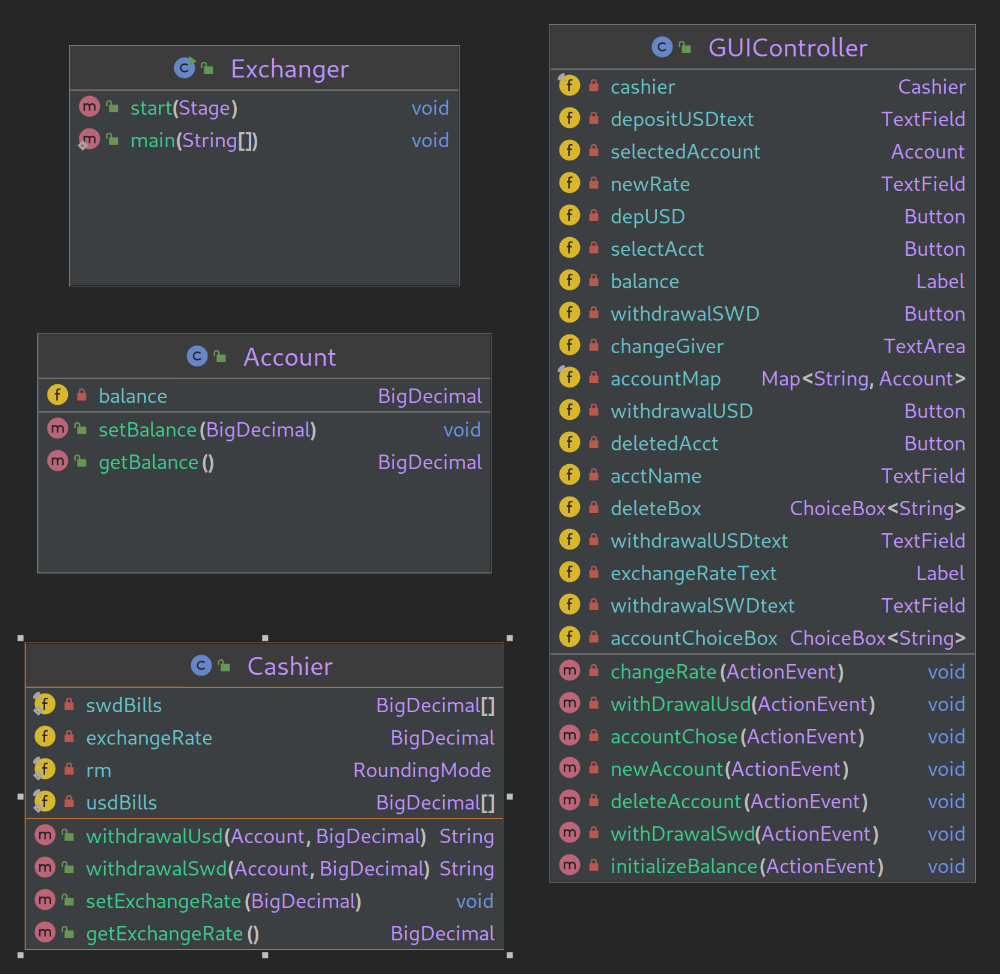

# Exchange Computation GUI
a java FX program that helps a cashier keep track of customer balance and exchange money between US dollars and SWD dollars. The cashier will have the option to specify the exchange rate between currencies, initialize the customer balance (in US dollars), withdraw some SWD dollars amount, and close the account.
#
### Developer Documentation
BigDecimal is used as the reference type of all balances and exchange rate in this program. This makes it easy to round without worrying about off by one errors that floats/doubles can make. The RoundingMode that is used is RoundingMode.Half_Even. I used this because it provides the lowest amount of error over lots of calculations and it is often used in banks and other financial institutes.

This program is split into 3 classes:

The ExchangeDriver class handles:
- Starting the application
- The command line interface

The Account class handles:
- Balance

The Cashier class handles:
- computation
- exchange rate
- withdrawing and making change

### User Documentation
Run the Exchanger class to open the application. You will then enter an account name and then select the account you want. You then can set your balance/ withdrawal/ change exchange rate/ delete account.
to exit the app hit the x in the top right corner.