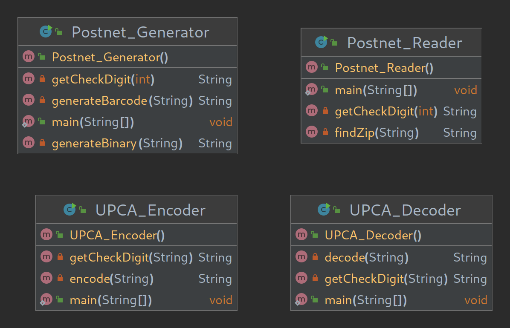

# Barcode Generator
a program that can generate and read both POSTNET and UPC barcodes
#

### Developer Documentation
This project has 4 different programs/executables in it. Both Postnet and UPCA classes use a map that allow to take a digit as a key and receive a code as a value or vise versa.

### User Documentation
- Run Postnet_Generator to encode a zipcode into a postnet barcode
- Run Postnet_Reader to decode a postnet barcode into a zipcode
- Run UPCA_Encoder to encode a product code into a UPCA barcode
- Run UPCA_Decoder to decode a UPCA barcode into a product code