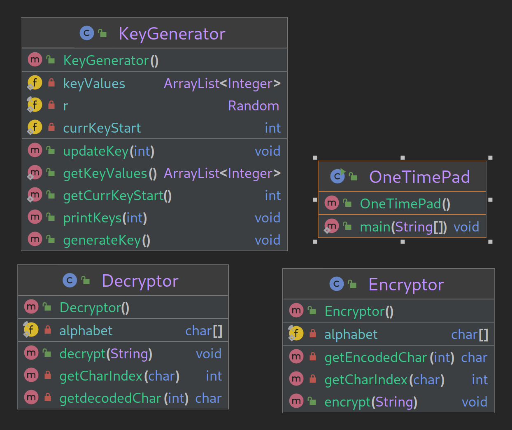

# One Time Pad Encryption
a program that can encrypt and decrypt messages using a key file that is generated.
#
### Developer Documentation

KeyGenerator generates a key file that is is the key to encrypt and decrypt
- uses a FileWriter object to write random n values to file
- user determines how many n values there will be

Encryptor class can encrypt a message and update the key file
- takes a message and for each non-space character shifts the char alphabetically by KeyFile[i] times

Decryptor class can decrypt a message and update the key file
- takes a cypher and for each non-space character shifts the char back alphabetically by KeyFile[i] times to receive the original message

### User Documentation
Run the OneTimePad class to start program

this will start by generating a keyfile with your choice of number of n values

then you will have option to encrypt or decrypt a message you will type in

or to exit enter 3