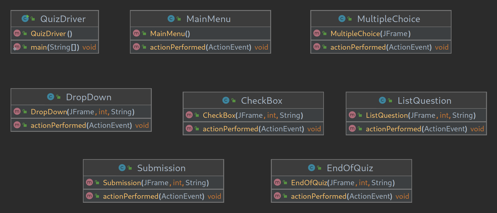

# Quiz Swing GUI
a java swing program which is a quiz for students in an elementary school using any material you like.  Each question should have at least 4 choices.
#
The components I used were:
- JRadioButton
- JCheckBox
- JComboBox
- JScrollPane
- JLists
- JProgressBar

### Developer Documentation

Each "Screen" is a separate class. In Main Menu the original JFrame is created and then JPanels are cycled in and out of the same frame. The frame, current score, and quiz summary are all passed through constructors updated after each question and all the way through to the EndOfQuiz constructor.

### User Documentation
To run the quiz, run quizDriver and a swing frame will open. Press begin quiz and start answering questions but be careful once you submit an answer you can not change your response to previous questions. At the end you will see your score and how each question was graded.
